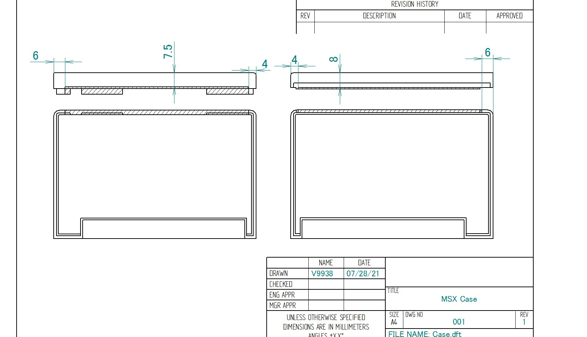

# MSX拡張Cartridge 2Slot Expander Cartridge  

  

MSX スロットを2つに増やす拡張ユニットです。

MSX規格の拡張スロット仕様に準拠しています。  
スロットの数を減らし、拡張スロットユニットに必要なバスバッファ・電源・音声ミキシング回路を省略することでできるだけ安価になるように設計しました。  

## ■ 利用上の注意点  

バスバッファー回路が無い都合上、本体およびカートリッジの組み合わせによる相性が出る場合があります。  

各スロットの電源容量は、本体に依存します。電力消費が大きいカートリッジでは動作しない可能性があります。(規格上は5V 100mAまで)  

SOUND IN端子は、2スロット間で直結しています。そのためサウンド出力を使うカートリッジを両方のスロットに挿さない様にしてください。最悪の場合カートリッジを壊す可能性があります。

BUSDIR信号にも対応しています。

本製品および、Boothおよび一部ショップにて販売予定です。  
<https://ifc.booth.pm/items/3625188>  

## ■ 使用方法

通常のカートリッジ同様に電源を切ったMSXスロットに挿入してください。

カートリッジは、正面が下側になるように本基板スロットに挿入してください。
SLOT0が拡張スロット0、SLOT1が拡張スロット3に割り付けてあります。

  

## ■ メモリマップ

MSXの拡張スロット仕様準拠です。

制御レジスタは拡張4スロット分実装してありますが、拡張スロット0／3の2つのみに対応しています。
  
## ■ 頒布基板について

サウンド、スロット信号について、テスト用端子(J1-J4)が用意しています。
切り離しが必要な場合は裏面のパターンをカットして使用してください。
周辺にはテスト用ランドを設けています。ミキシング回路やスイッチを追加してみてください。

    

回路図およびガーバファイルが必要な場合はPCBのフォルダーを参考にしてください。  

## ■ CPLDについて

CPLD Xillix XC9536XLの設計データはRTLのフォルダーを参照してください。  

## ■ カードリッジシェルについて

RGRさんのTransparent Cartridge Shell for MSX Konami-styleを切削加工したものを使用しています。  
<https://retrogamerestore.com/store/msx_cart_shell/>  

  

  

当方でも加工済みシェルを用意しており、シェルはBoothや委託先でも購入が可能です。  
輸入と加工の都合で若干の小傷がある場合があります。あらかじめご了承ください。  

切削加工部分については、下記図面を参照ください。（ハッチ部分が切削箇所）

  
